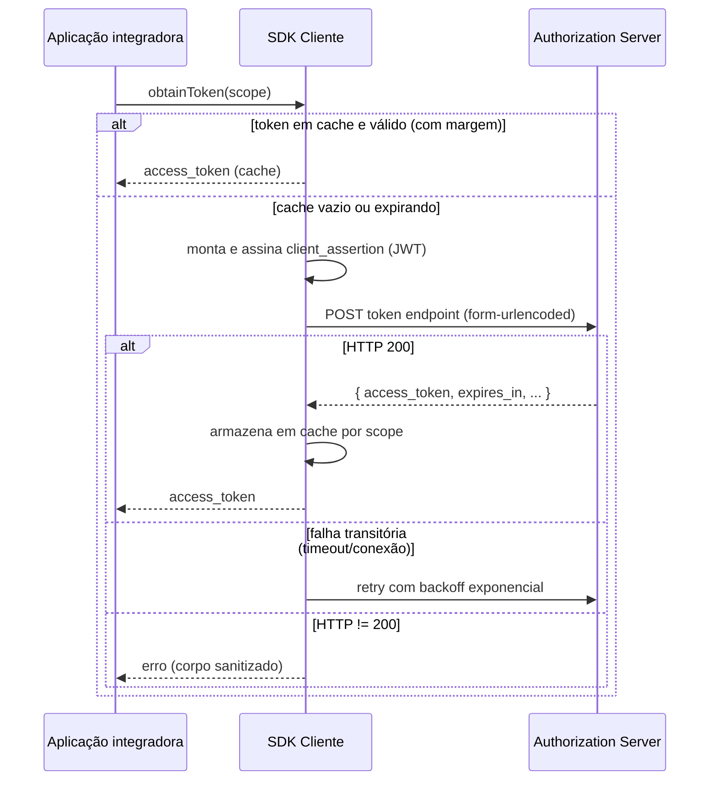

# Especificação de requisitos — Cliente HubSaúde (SDK)

> **Escopo deste documento.** Este é o **contrato comportamental** de um
> SDK cliente do HubSaúde para obtenção de tokens de acesso via
> [SMART Backend Services](https://hl7.org/fhir/smart-app-launch/backend-services.html).
> O SDK cliente do HubSaúde é distribuído como uma família de
> implementações equivalentes em linguagens diferentes (ver
> [§1.3](#13-portfólio-oficial-de-sdks)); os requisitos abaixo (`RF-xx`,
> `RNF-xx`) são a mesma numeração usada por todas elas, para permitir
> rastreabilidade cruzada.

- **Status:** projeto em desenvolvimento inicial (pré-alfa).
- **Público-alvo:** desenvolvedores de SDKs do HubSaúde e revisores.
- **Identificadores:** `RF-xx` (funcionais) e `RNF-xx` (não funcionais)
  são locais a este documento; não confundir com os requisitos centrais
  da plataforma HubSaúde.

## 1. Introdução

### 1.1 Objetivo

Um SDK cliente do HubSaúde encapsula, para o sistema integrador:

1. a montagem do JWT `client_assertion` (RFC 7523);
2. sua assinatura digital com a chave privada do cliente;
3. a troca do assertion por um `access_token` no endpoint OAuth 2.0;
4. cache, renovação e resiliência (retry) dessa obtenção;
5. a configuração TLS/mTLS da conexão com o servidor de autorização.

### 1.2 Fora de escopo

Ficam **fora** do escopo do SDK (delegados à camada de orquestração da
aplicação integradora):

- *Circuit breaker*, métricas e *tracing* (o SDK DEVE apenas expor
  pontos de integração, ex.: instância reutilizável e exceções
  diagnósticas);
- chamadas aos endpoints de dados FHIR (`/fhir/*`) — o SDK entrega o
  token; o uso em `Authorization: Bearer` é responsabilidade do
  integrador;
- gestão do credenciamento (o `client_id` e o registro da chave pública
  são obtidos previamente via Ganesha).

### 1.3 Portfólio oficial de SDKs

O portfólio planejado do HubSaúde é composto pelas quatro implementações
abaixo. Todas visam ao mesmo comportamento — este documento descreve o
estado de avanço de **uma** delas.

| Ecossistema | Projeto | Papel |
|-------------|---------|-------|
| Java | `hubsaude-cliente-java` | Implementação de referência |
| TypeScript/Node.js | `hubsaude-cliente-js` | SDK servidor, consumível também por JavaScript |
| C#/.NET | `hubsaude-cliente-csharp` | SDK para aplicações .NET |
| Python | `hubsaude-cliente-python` | SDK para aplicações e automações Python |

Todas as implementações DEVEM atender aos requisitos funcionais e não
funcionais deste documento. Nenhuma implementação prevalece sobre este
contrato; cada SDK DEVE oferecer uma API idiomática à sua linguagem.

## 2. Convenções

As palavras-chave **DEVE**, **NÃO DEVE**, **DEVERIA**, **PODE** e
**OPCIONAL** seguem o BCP 14 ([RFC 2119](https://datatracker.ietf.org/doc/html/rfc2119)
/ [RFC 8174](https://datatracker.ietf.org/doc/html/rfc8174)).

## 3. Referências normativas

| Referência | Descrição |
|------------|-----------|
| [SMART App Launch — Backend Services](https://hl7.org/fhir/smart-app-launch/backend-services.html) | Perfil HL7 para autenticação backend-to-backend |
| [RFC 6749](https://datatracker.ietf.org/doc/html/rfc6749) | OAuth 2.0 (`client_credentials`) |
| [RFC 7515](https://datatracker.ietf.org/doc/html/rfc7515) | JSON Web Signature (JWS) |
| [RFC 7518](https://datatracker.ietf.org/doc/html/rfc7518) | JSON Web Algorithms (JWA) |
| [RFC 7519](https://datatracker.ietf.org/doc/html/rfc7519) | JSON Web Token (JWT) |
| [RFC 7521](https://datatracker.ietf.org/doc/html/rfc7521) / [RFC 7523](https://datatracker.ietf.org/doc/html/rfc7523) | Assertion Framework e JWT profile |
| [SMART clinical scopes (STU2)](http://hl7.org/fhir/smart-app-launch/STU2/scopes-and-launch-context.html#clinical-scope-syntax) | Sintaxe dos scopes (`system/Recurso.ações`) |
| [W3C Trace Context](https://www.w3.org/TR/trace-context/) | Header `traceparent` (correlação com a plataforma) |

## 4. Terminologia

| Termo | Definição |
|-------|-----------|
| AS | *Authorization Server* — servidor de autorização do HubSaúde |
| `client_id` | Identificador do cliente, emitido no credenciamento (Ganesha) |
| `client_assertion` | JWT assinado pelo cliente que comprova posse da chave privada |
| Token endpoint | URL `POST` que emite o `access_token` (ex.: `/auth/token`) |
| Scope | Permissão solicitada, sintaxe SMART (ex.: `system/Patient.rs`) |
| Estratégia de assinatura | Abstração da operação de assinar bytes, independente da fonte da chave |
| Trust anchor | Certificado X.509 do servidor confiado explicitamente (substitui o trust store padrão) |
| mTLS | TLS mútuo: o cliente apresenta certificado no handshake |

## 5. Visão geral do fluxo

Este é o fluxo-alvo do SDK completo. **Nesta base de código, o
orquestrador (`App->>SDK->>AS`) ainda não existe** — o que está
implementado hoje são colaboradores isolados que o orquestrador vai
compor.

## 6. Requisitos funcionais

### 6.1 Autenticação SMART Backend Services

#### RF-01 — Construção do `client_assertion` (JWT) — ❌ Não implementado

1. O SDK DEVE construir um JWS compacto (`header.payload.assinatura`),
   com cada parte codificada em **Base64URL sem padding** (RFC 7515).
2. O header DEVE conter os campos `alg` e `typ` (`"JWT"`); `kid` é
   RECOMENDADO quando um identificador de chave estiver configurado.
3. O payload DEVE conter as claims:
   - `iss` = `client_id`;
   - `sub` = `client_id`;
   - `aud` = URL do token endpoint efetivo (o mesmo da requisição);
   - `iat` = instante atual (epoch, segundos);
   - `exp` = `iat` + TTL configurado (padrão **60 s**; ver
     [§8](#8-parâmetros-de-configuração));
   - `jti` = identificador único por assertion (UUID aleatório),
     que NÃO DEVE ser reutilizado;
   - `hub_ctx` = objeto `{"ig": "<alias>", "versao": "<semver>"}` com o
     contexto de Guia de Implementação pretendido, quando configurado
     via `hubContext(ig, versao)` (concern
     `client-assertion-contexto-ig.md` §3.4). O `ig` DEVE seguir
     `[a-z][a-z0-9-]{1,30}` e a `versao` DEVE ser SemVer completo
     `MAJOR.MINOR.PATCH` (sem pre-release); valores inválidos DEVEM
     ser rejeitados na configuração. Quando não configurado, o claim
     DEVE ser omitido.
4. O TTL DEVERIA ser ≤ 300 s: o servidor rejeita `exp` superior a
   `iat + 300` (contrato do simulador).
5. A serialização JSON do payload DEVE aplicar *escaping* correto.
6. A entrada da assinatura DEVE ser a string ASCII
   `base64url(header) + "." + base64url(payload)`.
7. Um novo assertion DEVE ser gerado a cada requisição real ao token
   endpoint (nunca reutilizado).

*Status atual:* nenhum código monta ou assina um `client_assertion`.
Existe apenas a peça criptográfica de baixo nível reaproveitável por
esse requisito quando ele for implementado — ver RF-16.

#### RF-02 — Requisição de token — ❌ Não implementado

1. O SDK DEVE enviar `POST` ao token endpoint com
   `Content-Type: application/x-www-form-urlencoded`, contendo
   `grant_type`, `client_id`, `client_assertion_type`,
   `client_assertion` e `scope` (omitido quando vazio).
2. A requisição DEVE respeitar os timeouts de conexão e de requisição
   configurados.
3. Toda requisição HTTP DEVE incluir o header `traceparent`
   ([W3C Trace Context](https://www.w3.org/TR/trace-context/)), com um
   par trace-id/span-id novo por tentativa (inclusive retries).

*Status atual:* nenhuma requisição HTTP é feita pelo SDK ainda; a peça
de geração do `traceparent` que essa requisição vai usar já existe — ver
RF-02 na coluna de status abaixo e a seção 6.4.

#### RF-02b — Geração do contexto de trace (`traceparent`) — ✅ Implementado

1. O SDK DEVE gerar, por requisição, um par trace-id (16 bytes
   aleatórios, 32 hex minúsculos)/span-id (8 bytes aleatórios, 16 hex
   minúsculos), nunca todo-zeros, a partir de um gerador
   criptograficamente seguro.
2. O SDK DEVE montar o valor do header no formato
   `00-<trace-id>-<span-id>-00` (versão `00`, trace-flags `00` —
   *not sampled*, pois o SDK não grava spans).
3. Instâncias do contexto de trace DEVEM ser imutáveis e validar o
   formato W3C na construção, rejeitando trace-id/span-id fora do
   formato (tamanho, maiúsculas, todo-zeros) com erro explícito.

*Como implementado:* `trace.TraceContext`, com `generate()` para criar
um novo par e `traceparent()` para montar o header. O envio efetivo
desse header numa requisição HTTP (RF-02.3) ainda depende do
orquestrador inexistente.

#### RF-03 — Tratamento da resposta — ❌ Não implementado

1. Exclusivamente **HTTP 200** DEVE ser tratado como sucesso.
2. Na resposta de sucesso, o SDK DEVE extrair `access_token` (ausência
   é erro), `expires_in` (padrão **3600** se ausente), ignorar campos
   desconhecidos e disponibilizar o corpo JSON cru ao chamador.
3. **HTTP 429** DEVE resultar em erro imediato, sem retry automático.
4. Qualquer outro status ≠ 200 DEVE resultar em erro com o status e o
   corpo sanitizado (ver [RNF-02](#rnf-02--sanitização-de-logs-e-mensagens-de-erro)).

*Status atual:* não há código que envie ou interprete uma resposta HTTP.

### 6.2 Cache e concorrência

#### RF-04 — Cache de tokens por scope — ✅ Implementado

1. O SDK DEVE manter cache de tokens **indexado pelo scope
   normalizado**: string com espaços laterais removidos (*trim*);
   scope nulo/`None` equivale à string vazia.
2. O cache DEVE ser habilitável/desabilitável por configuração.
3. Um token em cache DEVE ser considerado válido somente se
   `agora + margem < instante_de_expiração`, com margem configurável
   (padrão **30 s**).
4. Quando servido do cache, o resultado DEVE informar o tempo restante
   de validade (mínimo 0).
5. O token DEVE ser armazenado no cache imediatamente após obtenção
   bem-sucedida.
6. O cache DEVE ter capacidade máxima configurável por quantidade de
   scopes (padrão **1.000**); ao atingir o teto, a inclusão de um novo
   scope DEVE remover a entrada menos recentemente usada (LRU).

*Como implementado:* `token_cache.TokenCacheStrategy`
(`cached_if_valid`, `store`, `invalidate`, `invalidate_all`, `size`),
com `CachedToken`/`CachedTokenResponse`. A normalização do scope
(item 1) é responsabilidade documentada do chamador — ainda inexistente
— não desta classe. Uma entrada inválida encontrada em `cached_if_valid`
é removida na mesma chamada (*eviction* antecipada).

#### RF-05 — *Single-flight* por scope — ❌ Não implementado

1. Requisições concorrentes pelo **mesmo scope** NÃO DEVEM disparar
   obtenções simultâneas ao AS; apenas uma requisição em voo por scope,
   com as demais aguardando e reutilizando o resultado.
2. Após adquirir a exclusão mútua, o SDK DEVE reverificar o cache
   (*double-checked*) antes de ir à rede.
3. A implementação PODE usar *lock striping* para manter memória O(1)
   em relação ao número de scopes distintos.

*Status atual:* por design, este requisito é responsabilidade do
orquestrador HTTP (inexistente), não do cache — ver nota de escopo no
código de `token_cache.py`.

#### RF-06 — Invalidação de cache — ✅ Implementado (como operação de cache)

1. O SDK DEVE permitir invalidar todo o cache.
2. O SDK DEVE permitir invalidar o cache de um scope específico
   (aplicando a mesma normalização de RF-04.1).

*Como implementado:* `TokenCacheStrategy.invalidate(scope)` e
`invalidate_all()`. Ainda não exposto como método de uma API pública de
cliente (essa API não existe), apenas como método da classe de cache.

### 6.3 Resiliência

#### RF-07 — Retry com backoff exponencial — ⚠️ Parcial

1. São **falhas transitórias**, elegíveis a retry: timeout de conexão,
   timeout de requisição HTTP e recusa/queda de conexão TCP.
2. NÃO DEVEM sofrer retry automático: respostas HTTP recebidas (qualquer
   status, inclusive 429 e 5xx) e demais erros de I/O.
3. O total de tentativas DEVE ser limitado por `max_retries` (padrão
   **3**).
4. O atraso antes da tentativa `n+1` DEVE ser `1 s × 2^(n−1)`
   (1 s, 2 s, 4 s, ...), sem *jitter*.
5. Esgotadas as tentativas, o SDK DEVE falhar com erro que informe o
   número de tentativas e preserve a causa original.

*Como implementado:* apenas o cálculo do atraso (item 4) existe, em
`retry.compute_retry_delay_seconds(attempt)`. A classificação de falha
transitória (itens 1–2), o laço de tentativas e o esgotamento com erro
final (itens 3, 5) dependem do orquestrador HTTP, ainda inexistente. A
normalização de `max_retries` não positivo já existe, mas em outro
componente — ver RF-18.

#### RF-08 — Diagnóstico de rejeição de certificado de cliente (mTLS) — ❌ Não implementado

1. Quando uma falha de I/O indicar, heuristicamente, que o servidor
   rejeitou o certificado de cliente após o handshake mTLS, o SDK DEVE
   falhar imediatamente (sem retry) com mensagem diagnóstica.
2. Essa heurística DEVE apenas enriquecer a mensagem de erro.

*Status atual:* não há, ainda, nenhuma conexão TLS/mTLS estabelecida
pelo SDK.

### 6.4 Descoberta de endpoint

#### RF-09 — Descoberta via `.well-known/smart-configuration` — ❌ Não implementado

1. Alternativamente a um token endpoint explícito, o SDK DEVE aceitar
   uma URL base FHIR e resolver o endpoint via
   `GET <base>/.well-known/smart-configuration`.
2. `tokenEndpoint` e `fhirBase` DEVEM ser mutuamente exclusivos.
3. A descoberta DEVE usar a mesma configuração TLS/mTLS e os mesmos
   timeouts do cliente.
4. Resposta ≠ 200 ou sem `token_endpoint` DEVE resultar em erro.
5. A resolução DEVE ocorrer uma única vez, na construção do cliente.

*Status atual:* não há construção de cliente nem chamada de descoberta.

### 6.5 TLS e mTLS

#### RF-10 — Protocolo TLS e confiança no servidor — ❌ Não implementado

1. O protocolo TLS DEVE ser configurável; o padrão DEVE ser **TLS 1.3**.
2. Sem trust anchor customizado, o SDK DEVE validar o servidor pelo
   trust store padrão da plataforma.
3. O SDK DEVE aceitar um **trust anchor** customizado que substitui o
   trust store padrão.
4. O SDK NÃO DEVE oferecer na API pública um modo "confiar em tudo".

*Status atual:* a constante `DEFAULT_TLS_PROTOCOL = "TLSv1.3"` já existe
em `defaults.py`, mas nenhum código constrói ou configura um contexto
TLS.

#### RF-11 — mTLS (TLS mútuo) — ❌ Não implementado

1. Quando houver chave privada e certificado do cliente disponíveis, o
   SDK DEVE apresentar o certificado de cliente se o servidor o
   solicitar no handshake.
2. Quando o servidor não solicitar certificado, a conexão DEVE se
   comportar como TLS unidirecional.
3. O material de mTLS DEVE poder vir de chave+certificado em memória ou
   de um *keystore* da plataforma.
4. Na ausência de material de cliente, o SDK DEVE operar com TLS
   unidirecional, sem erro.

*Status atual:* nenhum código de configuração mTLS existe.

### 6.6 Material criptográfico

#### RF-12 — Fontes de chave (estratégia de assinatura) — ⚠️ Parcial

1. O SDK DEVE abstrair a assinatura em uma **estratégia** com um único
   contrato: `sign(bytes) -> bytes` (assinatura crua, não codificada),
   lançando erro específico de assinatura em falha criptográfica.
2. O SDK DEVE suportar múltiplas fontes de chave: memória, arquivo PEM
   (com/sem senha), PEM em string, *keystore* PKCS#12/JKS, HSM/PKCS#11.
3. Chave não encontrada ou PIN/senha inválidos DEVEM resultar em erro
   explícito.
4. A estratégia DEVE ser segura para chamada concorrente.

*Como implementado:* apenas o contrato existe —
`ports.SigningStrategy`, um `typing.Protocol` com o método
`sign(data: bytes) -> bytes`, verificável estruturalmente via
`isinstance`. Nenhuma implementação concreta (memória, PEM, PKCS#12,
HSM) está presente; item 2 e 3 permanecem pendentes.

#### RF-13 — Formatos de chave PEM — ❌ Não implementado

1. O SDK DEVE aceitar, com detecção automática de formato: PKCS#8 não
   criptografado, PKCS#1 RSA, PKCS#8 criptografado e OpenSSL tradicional
   criptografado.
2. Chave criptografada sem senha, ou com senha incorreta, DEVE resultar
   em erro indicando a causa provável.
3. Arquivo vazio, ilegível ou de formato não suportado DEVE resultar em
   erro que identifique a fonte.

*Status atual:* nenhum carregador de PEM existe. `tests/conftest.py` já
disponibiliza uma fixture (`fake_pem_pair`) com um par certificado/chave
PEM autoassinado gerado em memória, preparada para uso quando este
requisito for implementado.

#### RF-14 — Validação de certificado — ❌ Não implementado

1. Certificados X.509 fornecidos DEVEM ser validados na carga: parse
   bem-sucedido e período de validade corrente.
2. Certificado expirado, ainda não válido, ou arquivo sem certificado
   X.509 DEVEM resultar em erro que identifique o arquivo e a condição.

*Status atual:* nenhum código de validação de certificado existe.

#### RF-15 — Consistência chave–certificado — ❌ Não implementado

1. Quando chave privada e certificado forem fornecidos diretamente, o
   SDK DEVE verificar na construção que formam um par válido.
2. A verificação DEVE suportar ao menos chaves RSA e EC.
3. Falha na verificação DEVE impedir a construção do cliente.

*Status atual:* nenhum código de verificação existe.

#### RF-16 — Algoritmos de assinatura — ✅ Implementado

1. O algoritmo JWT (`alg`) DEVE ser configurável; o padrão DEVE ser
   **RS384**.
2. O SDK DEVE suportar, no mínimo: `RS256`, `RS384`, `RS512` (RSA
   PKCS#1 v1.5), `PS256`, `PS384`, `PS512` (RSA-PSS) e `ES256`, `ES384`,
   `ES512` (ECDSA). Valor não reconhecido DEVE resultar em erro que
   liste os válidos (comparação *case-insensitive*).
3. O algoritmo configurado DEVE determinar o valor do header `alg` e o
   algoritmo criptográfico correspondente.
4. Para `ES*`, a assinatura JWS DEVE estar no formato bruto `R || S`
   (RFC 7518 §3.4); plataformas cuja API produz DER/ASN.1 DEVEM
   converter.

*Como implementado:* `algorithms.resolve(jwt_algorithm)` retorna os
parâmetros criptográficos (função de hash; para PSS, `salt_length`;
para ECDSA, curva e `signature_length`) para os 9 algoritmos, com erro
(`SmartTokenError`) listando os válidos quando o algoritmo é
desconhecido. `algorithms.encode_p1363`/`decode_p1363` fazem a
conversão DER ↔ `R||S` exigida pelo item 4, usando `cryptography`
(`utils.decode_dss_signature`/`encode_dss_signature`). O padrão
`RS384` já está declarado em `defaults.DEFAULT_JWT_ALGORITHM`, mas
nenhum componente ainda o consome (item 1 depende da configuração do
cliente, inexistente). O uso efetivo desses parâmetros para assinar um
JWT (itens 1 e 3, na prática) depende de RF-01 e RF-12, ainda
pendentes.

### 6.7 API pública

#### RF-17 — Operações mínimas — ❌ Não implementado

O SDK DEVE expor, com nomes idiomáticos da linguagem: `obtainToken(scope)`,
`obtainTokenResponse(scope)`, `invalidateCache()`/`invalidateCache(scope)`,
`getTokenEndpoint()`, `getJwtAlgorithm()`, construção validada
(builder/kwargs) e uma operação de liberação de recursos.

*Status atual:* o módulo público (`hubsaude_client/__init__.py`)
reexporta apenas `SmartTokenError`, `SigningStrategy` e `TraceContext`
— os colaboradores de mais baixo nível já implementados. Nenhuma classe
de cliente com as operações acima existe.

#### RF-18 — Validações de configuração — ⚠️ Parcial

Na construção, o SDK DEVE aplicar validações como: exclusividade entre
`tokenEndpoint`/`fhirBase`; presença de `clientId`; exclusividade entre
estratégia de assinatura e chave PEM; normalização de valores não
positivos de TTL/`maxRetries`/margem do cache; rejeição de
`tokenCacheMaxEntries` ≤ 0; rejeição de timeouts nulos.

*Como implementado:* dois agrupamentos de configuração já existem e já
aplicam parte destas regras isoladamente:
- `fault_tolerance.FaultToleranceConfig` — normaliza
  `assertion_ttl_seconds` e `max_retries` não positivos para os
  padrões (`__post_init__`); `connect_timeout`/`request_timeout` são
  obrigatórios por tipagem, sem validação adicional em runtime.
- `token_cache.TokenCacheStrategy` — rejeita `max_entries <= 0` com
  `ValueError` no construtor.

As demais validações (exclusividade `tokenEndpoint`/`fhirBase`,
`clientId` obrigatório, exclusividade de estratégia de assinatura)
pressupõem uma classe de configuração/builder de cliente que ainda não
existe.

#### RF-19 — Modelo de erros — ✅ Implementado

1. O SDK DEVE definir ao menos dois tipos de erro: um erro de token
   (configuração inválida de material criptográfico, respostas
   inesperadas do AS, JSON inválido, algoritmo não suportado) e um erro
   de assinatura (falha criptográfica na estratégia de assinatura).
2. Erros DEVEM preservar a causa original (exceção encadeada) e conter
   mensagens acionáveis, sem expor segredos.

*Como implementado:* `exceptions.SmartTokenError(RuntimeError)` e
`exceptions.SigningError(RuntimeError)`, ambas aceitando uma mensagem
obrigatória e uma causa original opcional (`cause`), disponibilizada em
`__cause__` quando fornecida. Uso atual de `SmartTokenError`:
algoritmo JWT não reconhecido (`algorithms.resolve`). Nenhum caso de
uso ainda manipula segredos, então o item "sem expor segredos" não tem,
hoje, um cenário de teste que o exercite.

## 7. Requisitos não funcionais

#### RNF-01 — Thread-safety e ciclo de vida — ⚠️ Parcial

A instância do cliente DEVE ser thread-safe e reutilizável pelo ciclo de
vida da aplicação, com fechamento idempotente que aguarda operações em
voo e invalida o cache antes de liberar recursos.

*Status atual:* não há uma instância de cliente com ciclo de vida
próprio. Individualmente, `TokenCacheStrategy` já é thread-safe (todo
acesso à estrutura interna é protegido por um único `threading.Lock` de
instância) e `FaultToleranceConfig`/`TraceContext`, por serem
dataclasses imutáveis, são seguras para compartilhamento entre threads
após construídas.

#### RNF-02 — Sanitização de logs e mensagens de erro — ❌ Não implementado

1. Tokens, chaves privadas e senhas NÃO DEVEM aparecer em logs nem em
   mensagens de exceção.
2. Corpos de resposta incluídos em erros DEVEM ser sanitizados (valores
   de token substituídos por `[REDACTED]`, corpo limitado a 500
   caracteres).
3. Logs DEVEM usar a infraestrutura padrão da plataforma, em níveis
   apropriados (debug/info/warn/error).

*Status atual:* o SDK ainda não registra logs nem constrói mensagens de
erro a partir de corpos de resposta HTTP, pois nenhuma requisição HTTP é
feita. `CachedToken.__repr__` já mascara o `access_token`
(`[REDACTED]`) para evitar exposição acidental em `repr()`/logs, o que
é consistente com o espírito deste requisito, embora aplicado apenas ao
cache.

#### RNF-03 — Higiene de segredos em memória — ❌ Não implementado

Senhas e PINs DEVEM ser recebidos em estruturas mutáveis da plataforma e
limpos (zerados) após o uso, quando a plataforma permitir.

*Status atual:* não aplicável ainda — nenhum código do SDK recebe senha
ou PIN.

#### RNF-04 — Dependências mínimas — ✅ Implementado (nesta fase)

O SDK DEVERIA usar primordialmente a biblioteca padrão da plataforma,
admitindo dependências pontuais apenas para lacunas reais. NÃO DEVE
depender de frameworks de aplicação.

*Status atual:* as dependências de execução declaradas são um cliente
HTTP e uma biblioteca de criptografia; desta última, apenas a parte de
assinatura ECDSA (conversão DER/`R||S`) é hoje efetivamente usada, em
`algorithms.py`. A biblioteca de cliente HTTP está declarada mas ainda
não é importada por nenhum módulo. Uma dependência opcional para
HSM/PKCS#11 está declarada para uso futuro. Nenhuma dependência de
framework de aplicação é usada.

#### RNF-05 — Desempenho — ⚠️ Parcial

Com cache habilitado, chamadas repetidas por scope DEVEM ser servidas
sem I/O de rede enquanto o token for válido; a estrutura de locks DEVE
ter memória constante.

*Status atual:* como não há orquestrador de rede, não há, hoje, uma
chamada real de obtenção de token a ser evitada pelo cache. O cache em
si (`TokenCacheStrategy`) já atende à política de servir do cache
quando válido; a garantia de memória constante da estrutura de locks é
responsabilidade do futuro *single-flight* (RF-05), ainda pendente.

#### RNF-06 — Testes e cobertura — ✅ Implementado (para o que existe)

1. O SDK DEVE ter testes automatizados independentes de serviços
   externos.
2. Cobertura mínima de linha: **85%**, aplicada como *gate*.

*Status atual:* a suíte de testes cobre integralmente os componentes já
implementados (algoritmos, protocolo de assinatura, cache de tokens,
cálculo de retry, configuração de tolerância a falhas, contexto de
trace, exceções, constantes padrão), sem dependência de serviços
externos, com o *gate* de 85% de cobertura de linha configurado em
`tox.ini` (`pytest --cov-fail-under=85`). Os casos de teste mínimos que
dependem de componentes não implementados (JWT, form body, resposta
HTTP, single-flight, mTLS, descoberta, PEM, certificado) ainda não têm
como existir.

#### RNF-07 — Documentação — ⚠️ Parcial

API pública documentada no formato da plataforma, incluindo exemplos de
uso por fonte de chave e a recomendação de circuit breaker externo.

*Status atual:* todo o código implementado tem docstrings em
português cobrindo módulo, classes e métodos públicos. `README.md` e os
documentos em `docs/` (`integracao-enterprise.md`,
`troubleshooting.md`) já têm a estrutura de seções planejada (títulos),
mas o conteúdo ainda não foi escrito.

#### RNF-08 — Licença, versionamento e release — ⚠️ Parcial

Licença permissiva; SemVer; publicação disparada por tag; artefato
acompanhado de SBOM quando o ecossistema suportar.

*Status atual:* o pacote está versionado como `0.1.0`
(`pyproject.toml`); há um arquivo `LICENSE`, porém vazio nesta revisão
do repositório. Não há automação de release nem geração de SBOM
configuradas ainda.

## 8. Parâmetros de configuração

Parâmetros já suportados por algum componente, mesmo sem uma classe de
configuração unificada de cliente:

| Parâmetro | Padrão | Onde já existe | Observações |
|-----------|--------|-----------------|-------------|
| `assertionTtlSeconds` | 60 | `FaultToleranceConfig` | ≤ 0 → padrão |
| `maxRetries` | 3 | `FaultToleranceConfig` | ≤ 0 → padrão; laço de tentativas ainda não existe |
| `connectTimeout` | 10 s | `FaultToleranceConfig` | obrigatório; ainda não usado por um cliente HTTP |
| `requestTimeout` | 30 s | `FaultToleranceConfig` | obrigatório; ainda não usado por um cliente HTTP |
| `enableTokenCache` | `true` (semântica) | `TokenCacheStrategy(enabled=...)` | flag obrigatória no construtor, sem padrão implícito |
| `tokenCacheMarginSeconds` | 30 | `TokenCacheStrategy` | |
| `tokenCacheMaxEntries` | 1.000 | `TokenCacheStrategy` | deve ser positivo; descarte LRU por scope |
| `jwtAlgorithm` | `RS384` | `defaults.DEFAULT_JWT_ALGORITHM`, `algorithms.resolve` | constante declarada; nenhum componente de configuração ainda a consome como parâmetro |
| `tlsProtocol` | `TLSv1.3` | `defaults.DEFAULT_TLS_PROTOCOL` | constante declarada; nenhuma configuração TLS existe ainda |

Parâmetros do contrato completo (`tokenEndpoint`, `fhirBase`, `clientId`,
`privateKeyPem`, `privateKeyPassword`, `signingStrategy`,
`certificatePem`, `clientKeyStore`, `serverTrustAnchor`, `keyId`,
`hubContext`) ainda não têm nenhum ponto de configuração nesta base de
código — dependem das classes descritas como não implementadas na
seção 6.

## 9. Diretrizes de implementação já adotadas

- **Separação assinatura ↔ HTTP:** um contrato arquitetural bloqueante
  (`import-linter`, `pyproject.toml`) impede que o módulo de algoritmos
  criptográficos (`algorithms.py`) importe a biblioteca de cliente HTTP,
  preservando a independência entre os dois eixos previstos em RF-12 e
  RF-01/RF-02 mesmo antes de o segundo existir.
- **Assinaturas ECDSA (`ES*`):** a API de assinatura em uso produz DER;
  a conversão para o formato bruto `R||S` exigido por um JWS é feita
  explicitamente (`algorithms.encode_p1363`/`decode_p1363`), conforme
  RF-16.4.
- **Concorrência do cache:** um único lock de instância protege toda a
  estrutura de dados do cache; o *single-flight* de renovação (RF-05) é
  deliberadamente responsabilidade de outro componente (o futuro
  orquestrador), por design documentado no próprio módulo de cache.

## 10. Rastreabilidade — requisito → implementação

| Requisito | Símbolo de código | Status |
|-----------|--------------------|--------|
| RF-01 | — | ❌ |
| RF-02 | — | ❌ |
| RF-02b (trace) | `trace.TraceContext` | ✅ |
| RF-03 | — | ❌ |
| RF-04 | `token_cache.TokenCacheStrategy`, `CachedToken`, `CachedTokenResponse` | ✅ |
| RF-05 | — | ❌ |
| RF-06 | `token_cache.TokenCacheStrategy.invalidate()`/`.invalidate_all()` | ✅ (como operação de cache) |
| RF-07 | `retry.compute_retry_delay_seconds()` | ⚠️ |
| RF-08 | — | ❌ |
| RF-09 | — | ❌ |
| RF-10 | `defaults.DEFAULT_TLS_PROTOCOL` (constante apenas) | ❌ |
| RF-11 | — | ❌ |
| RF-12 | `ports.SigningStrategy` | ⚠️ |
| RF-13 | — | ❌ |
| RF-14 | — | ❌ |
| RF-15 | — | ❌ |
| RF-16 | `algorithms.resolve()`, `algorithms.encode_p1363()`, `algorithms.decode_p1363()` | ✅ |
| RF-17 | `__init__.py` (reexporta apenas os colaboradores abaixo) | ❌ |
| RF-18 | `FaultToleranceConfig.__post_init__`, `TokenCacheStrategy.__init__` | ⚠️ |
| RF-19 | `exceptions.SmartTokenError`, `exceptions.SigningError` | ✅ |
| RNF-02 | `CachedToken.__repr__` (mascaramento parcial) | ❌ (geral) |
| RNF-04 | `pyproject.toml` → `[tool.importlinter]` | ✅ |
| RNF-06 | `tox.ini` (`pytest --cov-fail-under=85`) | ✅ |

## 11. Casos de teste mínimos de conformidade

Dos casos de teste mínimos que um SDK completo deveria cobrir, os
seguintes já têm cobertura nesta base (arquivo entre parênteses):

1. **Algoritmos**: mapeamento dos 9 valores de RF-16; valor inválido
   rejeitado; *case-insensitive* (`test_algorithms.py`).
2. **Conversão ECDSA**: round-trip DER ↔ `R||S` (`test_algorithms.py`).
3. **Estratégia de assinatura**: conformidade estrutural ao protocolo
   (`test_ports.py`).
4. **Cache**: hit dentro da validade; miss após expirar a margem;
   scopes distintos independentes; invalidação total e por scope; cache
   desabilitado; teto LRU (`test_token_cache.py`).
5. **Retry (cálculo)**: fórmula do backoff 1s/2s/4s/...; `attempt < 1`
   rejeitado (`test_retry.py`).
6. **Validações de construção (parcial)**: normalização de TTL/retries
   inválidos (`test_fault_tolerance.py`); rejeição de `max_entries` não
   positivo (`test_token_cache.py`).
7. **Trace**: formato do `traceparent`; validação de trace-id/span-id;
   unicidade entre chamadas de `generate()` (`test_trace.py`).
8. **Erros**: mensagem e encadeamento de causa (`test_exceptions.py`).

Os demais casos mínimos de um SDK completo — JWT, form body, resposta
HTTP, HTTP 429/erros, single-flight, mTLS, descoberta, PEM, certificado,
par chave–certificado — não têm como existir ainda, pois dependem de
componentes listados como não implementados na seção 6.

## 12. Evolução prevista

A ordem sugerida para os próximos incrementos, pelas dependências entre
componentes, é: implementação concreta de `SigningStrategy` para chave
em memória e carregamento de PEM (RF-12, RF-13) → montagem e assinatura
do `client_assertion` (RF-01, reaproveitando RF-16) → cliente HTTP com
requisição ao token endpoint, consumindo `retry.py`, `token_cache.py` e
`trace.py` (RF-02, RF-03, RF-05, RF-07) → configuração TLS/mTLS
(RF-10, RF-11, RF-08) → descoberta de endpoint (RF-09) → validação de
certificado e consistência chave–certificado (RF-14, RF-15) → API
pública e validações de construção completas (RF-17, RF-18). Cada
incremento deve atualizar a coluna de status do requisito
correspondente neste documento.
