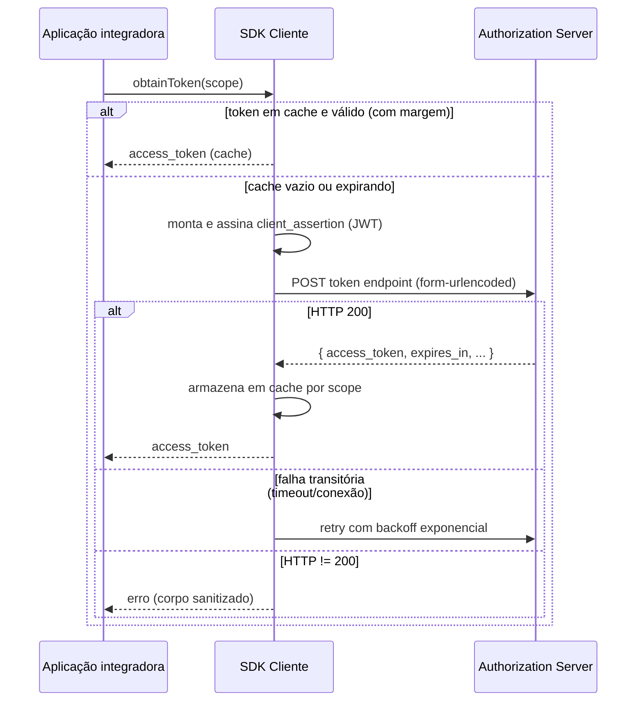

# Especificação de requisitos — Cliente HubSaúde (SDK)

> **Escopo deste documento.** Este é o **contrato comportamental** de um
> SDK cliente do HubSaúde para obtenção de tokens de acesso via
> [SMART Backend Services](https://hl7.org/fhir/smart-app-launch/backend-services.html).
> O SDK cliente do HubSaúde é distribuído como uma família de
> implementações equivalentes em linguagens diferentes (ver
> [§1.3](#13-portfólio-oficial-de-sdks)); os requisitos abaixo (`RF-xx`,
> `RNF-xx`) são a mesma numeração usada por todas elas, para permitir
> rastreabilidade cruzada.

- **Status:** projeto em desenvolvimento inicial (pré-alfa).
- **Público-alvo:** desenvolvedores de SDKs do HubSaúde e revisores.
- **Identificadores:** `RF-xx` (funcionais) e `RNF-xx` (não funcionais)
  são locais a este documento; não confundir com os requisitos centrais
  da plataforma HubSaúde.

## 1. Introdução

### 1.1 Objetivo

Um SDK cliente do HubSaúde encapsula, para o sistema integrador:

1. a montagem do JWT `client_assertion` (RFC 7523);
2. sua assinatura digital com a chave privada do cliente;
3. a troca do assertion por um `access_token` no endpoint OAuth 2.0;
4. cache, renovação e resiliência (retry) dessa obtenção;
5. a configuração TLS/mTLS da conexão com o servidor de autorização.

### 1.2 Fora de escopo

Ficam **fora** do escopo do SDK (delegados à camada de orquestração da
aplicação integradora):

- *Circuit breaker*, métricas e *tracing* (o SDK DEVE apenas expor
  pontos de integração, ex.: instância reutilizável e exceções
  diagnósticas);
- chamadas aos endpoints de dados FHIR (`/fhir/*`) — o SDK entrega o
  token; o uso em `Authorization: Bearer` é responsabilidade do
  integrador;
- gestão do credenciamento (o `client_id` e o registro da chave pública
  são obtidos previamente via Ganesha).

### 1.3 Portfólio oficial de SDKs

O portfólio planejado do HubSaúde é composto pelas quatro implementações
abaixo. Todas visam ao mesmo comportamento — este documento descreve o
estado de avanço de **uma** delas.

| Ecossistema | Projeto | Papel |
|-------------|---------|-------|
| Java | `hubsaude-cliente-java` | Implementação de referência |
| TypeScript/Node.js | `hubsaude-cliente-js` | SDK servidor, consumível também por JavaScript |
| C#/.NET | `hubsaude-cliente-csharp` | SDK para aplicações .NET |
| Python | `hubsaude-cliente-python` | SDK para aplicações e automações Python |

Todas as implementações DEVEM atender aos requisitos funcionais e não
funcionais deste documento. Nenhuma implementação prevalece sobre este
contrato; cada SDK DEVE oferecer uma API idiomática à sua linguagem.

## 2. Convenções

As palavras-chave **DEVE**, **NÃO DEVE**, **DEVERIA**, **PODE** e
**OPCIONAL** seguem o BCP 14 ([RFC 2119](https://datatracker.ietf.org/doc/html/rfc2119)
/ [RFC 8174](https://datatracker.ietf.org/doc/html/rfc8174)).

## 3. Referências normativas

| Referência | Descrição |
|------------|-----------|
| [SMART App Launch — Backend Services](https://hl7.org/fhir/smart-app-launch/backend-services.html) | Perfil HL7 para autenticação backend-to-backend |
| [RFC 6749](https://datatracker.ietf.org/doc/html/rfc6749) | OAuth 2.0 (`client_credentials`) |
| [RFC 7515](https://datatracker.ietf.org/doc/html/rfc7515) | JSON Web Signature (JWS) |
| [RFC 7518](https://datatracker.ietf.org/doc/html/rfc7518) | JSON Web Algorithms (JWA) |
| [RFC 7519](https://datatracker.ietf.org/doc/html/rfc7519) | JSON Web Token (JWT) |
| [RFC 7521](https://datatracker.ietf.org/doc/html/rfc7521) / [RFC 7523](https://datatracker.ietf.org/doc/html/rfc7523) | Assertion Framework e JWT profile |
| [SMART clinical scopes (STU2)](http://hl7.org/fhir/smart-app-launch/STU2/scopes-and-launch-context.html#clinical-scope-syntax) | Sintaxe dos scopes (`system/Recurso.ações`) |
| [W3C Trace Context](https://www.w3.org/TR/trace-context/) | Header `traceparent` (correlação com a plataforma) |

## 4. Terminologia

| Termo | Definição |
|-------|-----------|
| AS | *Authorization Server* — servidor de autorização do HubSaúde |
| `client_id` | Identificador do cliente, emitido no credenciamento (Ganesha) |
| `client_assertion` | JWT assinado pelo cliente que comprova posse da chave privada |
| Token endpoint | URL `POST` que emite o `access_token` (ex.: `/auth/token`) |
| Scope | Permissão solicitada, sintaxe SMART (ex.: `system/Patient.rs`) |
| Estratégia de assinatura | Abstração da operação de assinar bytes, independente da fonte da chave |
| Trust anchor | Certificado X.509 do servidor confiado explicitamente (substitui o trust store padrão) |
| mTLS | TLS mútuo: o cliente apresenta certificado no handshake |

## 5. Visão geral do fluxo

Este é o fluxo-alvo do SDK completo. **Nesta base de código, o
orquestrador (`App->>SDK->>AS`) já existe** como
`client.SmartTokenClient` (construído por
`builder.SmartTokenClientBuilder`), compondo os colaboradores descritos
nas seções seguintes. A configuração TLS/mTLS efetiva
(`tls_context_provider`) já tem implementações concretas de
`ports.TlsContextProvider` (`ssl_context_factory.py`, acessíveis via
`builder.certificate_pem()`/`client_key_store()`/`server_trust_anchor()`);
quem integra pode fornecer a própria implementação do Protocol apenas
para casos fora desses três (ex.: rotação dinâmica de certificado a
partir de um cofre).

## 6. Requisitos funcionais

### 6.1 Autenticação SMART Backend Services

#### RF-01 — Construção do `client_assertion` (JWT) — ✅ Implementado

1. O SDK DEVE construir um JWS compacto (`header.payload.assinatura`),
   com cada parte codificada em **Base64URL sem padding** (RFC 7515).
2. O header DEVE conter os campos `alg` e `typ` (`"JWT"`); `kid` é
   RECOMENDADO quando um identificador de chave estiver configurado.
3. O payload DEVE conter as claims:
   - `iss` = `client_id`;
   - `sub` = `client_id`;
   - `aud` = URL do token endpoint efetivo (o mesmo da requisição);
   - `iat` = instante atual (epoch, segundos);
   - `exp` = `iat` + TTL configurado (padrão **60 s**; ver
     [§8](#8-parâmetros-de-configuração));
   - `jti` = identificador único por assertion (UUID aleatório),
     que NÃO DEVE ser reutilizado;
   - `hub_ctx` = objeto `{"ig": "<alias>", "versao": "<semver>"}` com o
     contexto de Guia de Implementação pretendido, quando configurado
     via `hubContext(ig, versao)`. O `ig` DEVE seguir
     `[a-z][a-z0-9-]{1,30}` e a `versao` DEVE ser SemVer completo
     `MAJOR.MINOR.PATCH` (sem pre-release); valores inválidos DEVEM
     ser rejeitados na configuração. Quando não configurado, o claim
     DEVE ser omitido.
4. O TTL DEVERIA ser ≤ 300 s: o servidor rejeita `exp` superior a
   `iat + 300` (contrato do simulador).
5. A serialização JSON do payload DEVE aplicar *escaping* correto.
6. A entrada da assinatura DEVE ser a string ASCII
   `base64url(header) + "." + base64url(payload)`.
7. Um novo assertion DEVE ser gerado a cada requisição real ao token
   endpoint (nunca reutilizado).

*Como implementado:* `client.SmartTokenClient._build_client_assertion()`
monta o JWS compacto (header `alg`/`typ`, `kid` opcional; payload
`iss`/`sub`/`aud`/`iat`/`exp`/`jti`/`hub_ctx` opcional) e assina via
`signing_strategy.sign(...)` (port `ports.SigningStrategy`, item 6 da
lista acima). Um `jti` novo (`uuid.uuid4()`) é gerado a cada tentativa
real de requisição, inclusive em retries (item 7). O TTL (item 4) é
apenas avisado em log por `builder.py` quando excede o recomendado — o
servidor de autorização é quem de fato rejeitaria um `exp` acima do
limite, então isto não é validado como erro fail-fast (`DEVERIA`,
RFC 2119).

#### RF-02 — Requisição de token — ✅ Implementado

1. O SDK DEVE enviar `POST` ao token endpoint com
   `Content-Type: application/x-www-form-urlencoded`, contendo
   `grant_type`, `client_id`, `client_assertion_type`,
   `client_assertion` e `scope` (omitido quando vazio).
2. A requisição DEVE respeitar os timeouts de conexão e de requisição
   configurados.
3. Toda requisição HTTP DEVE incluir o header `traceparent`
   ([W3C Trace Context](https://www.w3.org/TR/trace-context/)), com um
   par trace-id/span-id novo por tentativa (inclusive retries).

*Como implementado:* `client.SmartTokenClient._fetch_token()` envia
`POST` (via `httpx.Client`) com os campos do form body (item 1),
respeitando `connect_timeout`/`request_timeout` de
`FaultToleranceConfig` (item 2, configurados no `httpx.Timeout` do
cliente) e incluindo `traceparent` com um `TraceContext` novo por
tentativa, inclusive retries (item 3).

#### RF-02b — Geração do contexto de trace (`traceparent`) — ✅ Implementado

1. O SDK DEVE gerar, por requisição, um par trace-id (16 bytes
   aleatórios, 32 hex minúsculos)/span-id (8 bytes aleatórios, 16 hex
   minúsculos), nunca todo-zeros, a partir de um gerador
   criptograficamente seguro.
2. O SDK DEVE montar o valor do header no formato
   `00-<trace-id>-<span-id>-00` (versão `00`, trace-flags `00` —
   *not sampled*, pois o SDK não grava spans).
3. Instâncias do contexto de trace DEVEM ser imutáveis e validar o
   formato W3C na construção, rejeitando trace-id/span-id fora do
   formato (tamanho, maiúsculas, todo-zeros) com erro explícito.

*Como implementado:* `trace.TraceContext`, com `generate()` para criar
um novo par e `traceparent()` para montar o header. O envio efetivo
desse header numa requisição HTTP (RF-02.3) já acontece em
`client.SmartTokenClient` e em `discovery.SmartConfigurationDiscovery`.

#### RF-03 — Tratamento da resposta — ✅ Implementado

1. Exclusivamente **HTTP 200** DEVE ser tratado como sucesso.
2. Na resposta de sucesso, o SDK DEVE extrair `access_token` (ausência
   é erro), `expires_in` (padrão **3600** se ausente), ignorar campos
   desconhecidos e disponibilizar o corpo JSON cru ao chamador.
3. **HTTP 429** DEVE resultar em erro imediato, sem retry automático.
4. Qualquer outro status ≠ 200 DEVE resultar em erro com o status e o
   corpo sanitizado (ver [RNF-02](#rnf-02--sanitização-de-logs-e-mensagens-de-erro)).

*Como implementado:* `client.SmartTokenClient._fetch_token()` só
delega a `response_guard.TokenResponseGuard.parse_success_response()`
quando `response.status_code == 200` (item 1); qualquer outro status
vai para `error_classifier.ErrorClassifier.http_failure()` (itens 3–4),
que loga em nível `WARNING` para 429 (sem retry, pois retry só ocorre
em falha de transporte — ver RF-07) e `ERROR` para os demais, com o
corpo sanitizado por `error_classifier.sanitize_error_response()`.
`TokenResponseGuard.parse_success_response()` extrai `access_token`
(erro se ausente/vazio), sanitiza `expires_in` com o padrão
`DEFAULT_EXPIRES_IN_SECONDS` (3600) quando ausente/inválido, ignora
campos desconhecidos na validação mas preserva o corpo cru em
`TokenResponse.raw` (item 2).

### 6.2 Cache e concorrência

#### RF-04 — Cache de tokens por scope — ✅ Implementado

1. O SDK DEVE manter cache de tokens **indexado pelo scope
   normalizado**: string com espaços laterais removidos (*trim*);
   scope nulo/`None` equivale à string vazia.
2. O cache DEVE ser habilitável/desabilitável por configuração.
3. Um token em cache DEVE ser considerado válido somente se
   `agora + margem < instante_de_expiração`, com margem configurável
   (padrão **30 s**).
4. Quando servido do cache, o resultado DEVE informar o tempo restante
   de validade (mínimo 0).
5. O token DEVE ser armazenado no cache imediatamente após obtenção
   bem-sucedida.
6. O cache DEVE ter capacidade máxima configurável por quantidade de
   scopes (padrão **1.000**); ao atingir o teto, a inclusão de um novo
   scope DEVE remover a entrada menos recentemente usada (LRU).

*Como implementado:* `token_cache.TokenCacheStrategy`
(`cached_if_valid`, `store`, `invalidate`, `invalidate_all`, `size`),
com `CachedToken`/`CachedTokenResponse`. A normalização do scope
(item 1) é responsabilidade do chamador (`client.SmartTokenClient._normalize_scope`,
`strip()`; `None` -> string vazia) — não desta classe. Uma entrada
inválida encontrada em `cached_if_valid` é removida na mesma chamada
(*eviction* antecipada).

#### RF-05 — *Single-flight* por scope — ✅ Implementado

1. Requisições concorrentes pelo **mesmo scope** NÃO DEVEM disparar
   obtenções simultâneas ao AS; apenas uma requisição em voo por scope,
   com as demais aguardando e reutilizando o resultado.
2. Após adquirir a exclusão mútua, o SDK DEVE reverificar o cache
   (*double-checked*) antes de ir à rede.
3. A implementação PODE usar *lock striping* para manter memória O(1)
   em relação ao número de scopes distintos.

*Como implementado:* `client.SmartTokenClient` mantém
`_scope_locks: list[threading.Lock]` de tamanho fixo
(`_SCOPE_LOCK_STRIPES = 32`), selecionado por
`hash(scope) % _SCOPE_LOCK_STRIPES` (item 3). Em
`obtain_token_response()`, um *miss* de cache adquire o lock do stripe
e reconsulta o cache antes de ir à rede (*double-checked locking*, item
2), garantindo no máximo uma requisição em voo por scope na prática
(item 1). Isso é responsabilidade de `client.py`, não de
`token_cache.py` — ver nota de escopo no código de `token_cache.py`.

#### RF-06 — Invalidação de cache — ✅ Implementado

1. O SDK DEVE permitir invalidar todo o cache.
2. O SDK DEVE permitir invalidar o cache de um scope específico
   (aplicando a mesma normalização de RF-04.1).

*Como implementado:* `TokenCacheStrategy.invalidate(scope)` e
`invalidate_all()`, expostos na API pública do cliente via
`client.SmartTokenClient.invalidate_cache(scope=None)` — `None` invalida
tudo (item 1); um scope explícito é normalizado e invalida só aquela
entrada (item 2).

### 6.3 Resiliência

#### RF-07 — Retry com backoff exponencial — ✅ Implementado

1. São **falhas transitórias**, elegíveis a retry: timeout de conexão,
   timeout de requisição HTTP e recusa/queda de conexão TCP.
2. NÃO DEVEM sofrer retry automático: respostas HTTP recebidas (qualquer
   status, inclusive 429 e 5xx) e demais erros de I/O.
3. O total de tentativas DEVE ser limitado por `max_retries` (padrão
   **3**).
4. O atraso antes da tentativa `n+1` DEVE ser `1 s × 2^(n−1)`
   (1 s, 2 s, 4 s, ...), sem *jitter*.
5. Esgotadas as tentativas, o SDK DEVE falhar com erro que informe o
   número de tentativas e preserve a causa original.

*Como implementado:* o cálculo do atraso (item 4) está em
`retry.compute_retry_delay_seconds(attempt)`. A classificação de falha
transitória (itens 1–2) é feita por
`error_classifier.ErrorClassifier.retriable_or_reraise()`/
`error_classifier.is_transient_network_failure()` — qualquer resposta
HTTP efetivamente recebida (inclusive 429/5xx) é tratada por
`http_failure()` e nunca chega ao laço de retry. O laço de tentativas e
o esgotamento com erro final (itens 3, 5) estão em
`client.SmartTokenClient._fetch_token()`, que preserva a causa original
(`raise ... from last_exc`). A normalização de `max_retries` não
positivo continua em outro componente — ver RF-18.

#### RF-08 — Diagnóstico de rejeição de certificado de cliente (mTLS) — ✅ Implementado

1. Quando uma falha de I/O indicar, heuristicamente, que o servidor
   rejeitou o certificado de cliente após o handshake mTLS, o SDK DEVE
   falhar imediatamente (sem retry) com mensagem diagnóstica.
2. Essa heurística DEVE apenas enriquecer a mensagem de erro.

*Como implementado:* a heurística em si já existe e está testada —
`error_classifier.is_likely_client_certificate_rejection()` reconhece
fragmentos de alerta TLS típicos desse cenário (`bad_record_mac`,
`certificate_revoked`, `certificate_expired`, etc., excluindo
`ssl.SSLCertVerificationError`, que é rejeição do certificado do
*servidor*, não do cliente) e `ErrorClassifier.retriable_or_reraise()`
falha imediatamente, sem retry, com mensagem diagnóstica (itens 1–2).
O ponto que antes ficava em aberto no código (equivalente Python de
`AEADBadTagException`, do lado Java) já foi decidido e documentado no
próprio `error_classifier.py`: a stdlib `ssl`/OpenSSL não expõe uma
exceção própria para falha de tag AEAD, e a fonte de verdade do lado
`.java` já registra que o mesmo evento de servidor aparece como
`bad_record_mac` no peer OpenSSL e como `AEADBadTagException` no peer
JSSE — logo, a heurística já cobre a superfície equivalente em Python.
Essa decisão foi validada contra um handshake mTLS **real** (sockets
loopback + OpenSSL de verdade, não apenas `ssl.SSLError` simulado) em
`tests/test_error_classifier_real_mtls.py`: sob TLS 1.2, a rejeição do
certificado de cliente produz `ssl.SSLError` com o alerta `unknown ca`;
sob TLS 1.3 (protocolo padrão desta lib), a superfície observada varia
por plataforma/versão do OpenSSL (`ssl.SSLEOFError` numa máquina,
alerta `unknown ca` limpo em outra) — ambas as variantes já são
reconhecidas pela heurística e, em qualquer caso, nunca são tratadas
como retriáveis.

### 6.4 Descoberta de endpoint

#### RF-09 — Descoberta via `.well-known/smart-configuration` — ✅ Implementado

1. Alternativamente a um token endpoint explícito, o SDK DEVE aceitar
   uma URL base FHIR e resolver o endpoint via
   `GET <base>/.well-known/smart-configuration`.
2. `tokenEndpoint` e `fhirBase` DEVEM ser mutuamente exclusivos.
3. A descoberta DEVE usar a mesma configuração TLS/mTLS e os mesmos
   timeouts do cliente.
4. Resposta ≠ 200 ou sem `token_endpoint` DEVE resultar em erro.
5. A resolução DEVE ocorrer uma única vez, na construção do cliente.

*Como implementado:* `discovery.SmartConfigurationDiscovery.discover_token_endpoint()`
resolve `<fhir_base>/.well-known/smart-configuration` (item 1) sobre um
`httpx.Client` recebido por injeção — nunca criado internamente —, o
mesmo usado pelo restante do cliente (item 3). A exclusividade mútua
entre `token_endpoint`/`fhir_base` (item 2) é validada em
`builder.SmartTokenClientBuilder._validate_endpoint_config()`.
`client.SmartTokenClient.__init__()` invoca a descoberta uma única vez,
quando `fhir_base` é informado (item 5). Resposta ≠ 200 ou sem
`token_endpoint` válido resulta em `SmartTokenError` (item 4).

### 6.5 TLS e mTLS

#### RF-10 — Protocolo TLS e confiança no servidor — ✅ Implementado

1. O protocolo TLS DEVE ser configurável; o padrão DEVE ser **TLS 1.3**.
2. Sem trust anchor customizado, o SDK DEVE validar o servidor pelo
   trust store padrão da plataforma.
3. O SDK DEVE aceitar um **trust anchor** customizado que substitui o
   trust store padrão.
4. O SDK NÃO DEVE oferecer na API pública um modo "confiar em tudo".

*Como implementado:* `ssl_context_factory.build_ssl_context()` monta um
`ssl.SSLContext(PROTOCOL_TLS_CLIENT)` com `minimum_version`/`maximum_version`
fixados no protocolo resolvido (`tls_protocol`, padrão
`defaults.DEFAULT_TLS_PROTOCOL = "TLSv1.3"`; `TLSv1.2` também aceito —
item 1). Sem `server_trust_anchor_path`/`trusted_cert`, chama
`context.load_default_certs(ssl.Purpose.SERVER_AUTH)` (trust store
padrão, item 2); com um dos dois, carrega o certificado informado via
`context.load_verify_locations(cadata=...)`, após validar seu período
de validade (`pem_loader.check_certificate_validity`, item 3). Acessível
via `builder.server_trust_anchor(caminho_ou_certificado)`. Nenhum modo
que desative a verificação do servidor é exposto na API pública (item
4).

#### RF-11 — mTLS (TLS mútuo) — ✅ Implementado

1. Quando houver chave privada e certificado do cliente disponíveis, o
   SDK DEVE apresentar o certificado de cliente se o servidor o
   solicitar no handshake.
2. Quando o servidor não solicitar certificado, a conexão DEVE se
   comportar como TLS unidirecional.
3. O material de mTLS DEVE poder vir de chave+certificado em memória ou
   de um *keystore* da plataforma.
4. Na ausência de material de cliente, o SDK DEVE operar com TLS
   unidirecional, sem erro.

*Como implementado:* `ssl_context_factory.build_ssl_context()` só
carrega o certificado de cliente
(`context.load_cert_chain`, via arquivo temporário de vida curta —
`ssl.SSLContext.load_cert_chain` exige caminho real, e o material chega
em memória) quando `client_key`/`client_cert` são ambos fornecidos
(itens 1, 4); a apresentação em si, condicionada à solicitação do
servidor no handshake, é comportamento nativo do `ssl.SSLContext`
(item 2, não reimplementado pela lib). O material chega em memória —
carregado de PEM (`builder.certificate_pem()` + `.private_key_pem()`)
ou de PKCS#12 (`builder.client_key_store()`, via
`strategy_factory.load_pkcs12_key_and_certificate`) — cobrindo o item 3.

### 6.6 Material criptográfico

#### RF-12 — Fontes de chave (estratégia de assinatura) — ✅ Implementado

1. O SDK DEVE abstrair a assinatura em uma **estratégia** com um único
   contrato: `sign(bytes) -> bytes` (assinatura crua, não codificada),
   lançando erro específico de assinatura em falha criptográfica.
2. O SDK DEVE suportar múltiplas fontes de chave: memória, arquivo PEM
   (com/sem senha), PEM em string, *keystore* PKCS#12/JKS, HSM/PKCS#11.
3. Chave não encontrada ou PIN/senha inválidos DEVEM resultar em erro
   explícito.
4. A estratégia DEVE ser segura para chamada concorrente.

*Como implementado:* o contrato é `ports.SigningStrategy` (item 1),
implementado por `PrivateKeySigningStrategy` (memória, PEM em arquivo,
PEM em string, PKCS#12 — via `strategy_factory.from_private_key`/
`from_pem_file`/`from_pem_string`/`from_pkcs12`) e por
`Pkcs11SigningStrategy` (HSM/smart token — `strategy_factory.from_pkcs11`,
que nunca extrai a chave do hardware, guardando só um handle de sessão
PKCS#11), cobrindo o item 2 (JKS explicitamente não é suportado — não é
um formato nativo do ecossistema Python; PKCS#12 cobre o caso
equivalente). Chave/certificado ausente, PIN ou senha incorretos
resultam em `SmartTokenError` explícito em todas as factories (item 3).
As implementações não mantêm estado mutável compartilhado além da chave
já carregada (imutável após construção) ou do handle PKCS#11 (item 4).

#### RF-13 — Formatos de chave PEM — ✅ Implementado

1. O SDK DEVE aceitar, com detecção automática de formato: PKCS#8 não
   criptografado, PKCS#1 RSA, PKCS#8 criptografado e OpenSSL tradicional
   criptografado.
2. Chave criptografada sem senha, ou com senha incorreta, DEVE resultar
   em erro indicando a causa provável.
3. Arquivo vazio, ilegível ou de formato não suportado DEVE resultar em
   erro que identifique a fonte.

*Como implementado:* `pem_loader.load_private_key`/
`load_private_key_from_string` delegam a
`cryptography...serialization.load_pem_private_key`, que detecta os 4
formatos automaticamente sem parsing manual por tipo de header PEM
(item 1); o módulo concentra o trabalho em mensagens de erro corretas
por causa (`SmartTokenError` distinguindo senha ausente, incorreta, ou
formato não suportado, incluindo a fonte — arquivo ou `<string>` — na
mensagem, itens 2–3). `tests/conftest.py` disponibiliza a fixture
`fake_pem_pair` (par certificado/chave PEM autoassinado gerado em
memória) usada pelos testes desse caminho.

#### RF-14 — Validação de certificado — ✅ Implementado

1. Certificados X.509 fornecidos DEVEM ser validados na carga: parse
   bem-sucedido e período de validade corrente.
2. Certificado expirado, ainda não válido, ou arquivo sem certificado
   X.509 DEVEM resultar em erro que identifique o arquivo e a condição.

*Como implementado:* `pem_loader.load_certificate` faz o parse (item 1)
e `pem_loader.check_certificate_validity` confere o período de validade
corrente contra `datetime.now(timezone.utc)`, usado tanto no carregamento
direto de certificado (`builder.certificate_pem()`) quanto no bundle
PKCS#12 (`strategy_factory.load_pkcs12_key_and_certificate`) e no trust
anchor de servidor (`ssl_context_factory._configure_trust`). Falhas
resultam em `SmartTokenError` identificando o arquivo/fonte e a condição
(expirado, ainda não válido, parse malsucedido — item 2).

#### RF-15 — Consistência chave–certificado — ✅ Implementado

1. Quando chave privada e certificado forem fornecidos diretamente, o
   SDK DEVE verificar na construção que formam um par válido.
2. A verificação DEVE suportar ao menos chaves RSA e EC.
3. Falha na verificação DEVE impedir a construção do cliente.

*Como implementado:* `key_certificate_consistency.verify_strategy`
compara a chave pública derivada da `SigningStrategy`/chave privada
carregada com a chave pública do certificado (RSA e EC — item 2),
invocada por `builder._resolve_tls_context_provider()` sempre que
`certificate_pem()` é usado junto de `private_key_pem()` (item 1). Uma
falha de correspondência levanta `SmartTokenError` em `build()`,
impedindo a construção do cliente (item 3). Para bundles PKCS#12
(`client_key_store()`), a consistência é garantida estruturalmente —
chave e certificado vêm do mesmo arquivo — sem necessidade de
verificação cruzada adicional.

#### RF-16 — Algoritmos de assinatura — ✅ Implementado

1. O algoritmo JWT (`alg`) DEVE ser configurável; o padrão DEVE ser
   **RS384**.
2. O SDK DEVE suportar, no mínimo: `RS256`, `RS384`, `RS512` (RSA
   PKCS#1 v1.5), `PS256`, `PS384`, `PS512` (RSA-PSS) e `ES256`, `ES384`,
   `ES512` (ECDSA). Valor não reconhecido DEVE resultar em erro que
   liste os válidos (comparação *case-insensitive*).
3. O algoritmo configurado DEVE determinar o valor do header `alg` e o
   algoritmo criptográfico correspondente.
4. Para `ES*`, a assinatura JWS DEVE estar no formato bruto `R || S`
   (RFC 7518 §3.4); plataformas cuja API produz DER/ASN.1 DEVEM
   converter.

*Como implementado:* `algorithms.resolve(jwt_algorithm)` retorna os
parâmetros criptográficos (função de hash; para PSS, `salt_length`;
para ECDSA, curva e `signature_length`) para os 9 algoritmos, com erro
(`SmartTokenError`) listando os válidos quando o algoritmo é
desconhecido. `algorithms.encode_p1363`/`decode_p1363` fazem a
conversão DER ↔ `R||S` exigida pelo item 4, usando `cryptography`
(`utils.decode_dss_signature`/`encode_dss_signature`). O padrão
`RS384` está declarado em `defaults.DEFAULT_JWT_ALGORITHM` e já é
consumido: `builder.SmartTokenClientBuilder.jwt_algorithm()` permite
sobrescrevê-lo e `_resolve_jwt_algorithm()` valida o valor final via
`algorithms.resolve()` (item 2); `client.SmartTokenClient._build_client_assertion()`
usa o resultado para montar o header `alg` (item 3) e para assinar o
JWS, incluindo a conversão P1363 para `ES*` (item 4, RF-01).

### 6.7 API pública

#### RF-17 — Operações mínimas — ✅ Implementado

O SDK DEVE expor, com nomes idiomáticos da linguagem: `obtainToken(scope)`,
`obtainTokenResponse(scope)`, `invalidateCache()`/`invalidateCache(scope)`,
`getTokenEndpoint()`, `getJwtAlgorithm()`, construção validada
(builder/kwargs) e uma operação de liberação de recursos.

*Como implementado:* `client.SmartTokenClient` expõe `obtain_token(scope)`,
`obtain_token_response(scope)` (retorna `TokenResult`),
`invalidate_cache(scope=None)`, `get_token_endpoint()`,
`get_jwt_algorithm()` e `close()` (idempotente, também disponível via
`with SmartTokenClient(...) as c:`). A construção validada é
`builder.SmartTokenClientBuilder` (métodos encadeáveis +
`build()` fail-fast). Nomes em `snake_case`, idiomático em Python — o
módulo público (`hubsaude_client/__init__.py`) continua reexportando
apenas `SmartTokenError`, `SigningStrategy` e `TraceContext`; os
consumidores importam `SmartTokenClient`/`SmartTokenClientBuilder`
diretamente de `hubsaude_client.client`/`hubsaude_client.builder`,
mesma convenção já usada pelos demais colaboradores internos.

#### RF-18 — Validações de configuração — ✅ Implementado

Na construção, o SDK DEVE aplicar validações como: exclusividade entre
`tokenEndpoint`/`fhirBase`; presença de `clientId`; exclusividade entre
estratégia de assinatura e chave PEM; normalização de valores não
positivos de TTL/`maxRetries`/margem do cache; rejeição de
`tokenCacheMaxEntries` ≤ 0; rejeição de timeouts nulos.

*Como implementado:* `builder.SmartTokenClientBuilder.build()`
orquestra, fail-fast, todas as validações: `client_id` obrigatório
(`_require_non_blank`); exclusividade entre `signing_strategy`/
`private_key_pem` (`_resolve_signing_strategy`); `tls_context_provider`
obrigatório e conforme o Protocol; exclusividade e esquema `https` de
`token_endpoint`/`fhir_base` (`_validate_endpoint_config`); algoritmo
JWT válido (`_resolve_jwt_algorithm`, via `algorithms.resolve`);
timeouts positivos (`_validate_timeouts`); `token_cache_max_entries`
positivo (`_validate_token_cache_max_entries`); e formato de
`hub_context` (`_build_hub_context`). A normalização (em vez de
rejeição) de TTL/`max_retries` não positivos continua em
`fault_tolerance.FaultToleranceConfig.__post_init__`, e a rejeição de
`max_entries` não positivo também é reforçada em
`token_cache.TokenCacheStrategy.__init__` (defesa em profundidade,
`ValueError`, além do `SmartTokenError` do builder).

#### RF-19 — Modelo de erros — ✅ Implementado

1. O SDK DEVE definir ao menos dois tipos de erro: um erro de token
   (configuração inválida de material criptográfico, respostas
   inesperadas do AS, JSON inválido, algoritmo não suportado) e um erro
   de assinatura (falha criptográfica na estratégia de assinatura).
2. Erros DEVEM preservar a causa original (exceção encadeada) e conter
   mensagens acionáveis, sem expor segredos.

*Como implementado:* `exceptions.SmartTokenError(RuntimeError)` e
`exceptions.SigningError(RuntimeError)`, ambas aceitando uma mensagem
obrigatória e uma causa original opcional (`cause`), disponibilizada em
`__cause__` quando fornecida. `SmartTokenError` agora é usada em todo o
cliente — algoritmo JWT não reconhecido (`algorithms.resolve`),
respostas inesperadas do token endpoint (`response_guard.py`), falhas
de rede/HTTP e suspeita de rejeição de certificado de cliente
(`error_classifier.py`), falha de descoberta (`discovery.py`) e
validações de configuração (`builder.py`). O item "sem expor segredos"
já tem cenário de teste: `error_classifier.sanitize_error_response()`
redige `access_token`/`token` (JSON e form-encoded) antes de truncar o
corpo em mensagens de erro, e `TokenResult`/`TokenResponse`/`CachedToken`
mascaram o token em `__repr__`.

## 7. Requisitos não funcionais

#### RNF-01 — Thread-safety e ciclo de vida — ✅ Implementado

A instância do cliente DEVE ser thread-safe e reutilizável pelo ciclo de
vida da aplicação, com fechamento idempotente que aguarda operações em
voo e invalida o cache antes de liberar recursos.

*Como implementado:* `client.SmartTokenClient` é pensado como singleton
por processo. Um `_ReadersWriterLock` privado (sem equivalente direto
no stdlib) protege o ciclo de vida: `obtain_token`/`obtain_token_response`
tomam o lock de leitura (fan-out concorrente entre scopes distintos);
`close()` toma o lock de escrita, concedido só após todas as leituras em
voo terminarem, invalida todo o cache e fecha o `httpx.Client` interno —
chamadas subsequentes a `close()` são no-op (`self._closed`).
Individualmente, `TokenCacheStrategy` já é thread-safe (todo acesso à
estrutura interna é protegido por um único `threading.Lock` de
instância) e `FaultToleranceConfig`/`TraceContext`, por serem
dataclasses imutáveis, são seguras para compartilhamento entre threads
após construídas.

#### RNF-02 — Sanitização de logs e mensagens de erro — ✅ Implementado

1. Tokens, chaves privadas e senhas NÃO DEVEM aparecer em logs nem em
   mensagens de exceção.
2. Corpos de resposta incluídos em erros DEVEM ser sanitizados (valores
   de token substituídos por `[REDACTED]`, corpo limitado a 500
   caracteres).
3. Logs DEVEM usar a infraestrutura padrão da plataforma, em níveis
   apropriados (debug/info/warn/error).

*Como implementado:* `error_classifier.sanitize_error_response()`
redige `access_token`/`token` (JSON e form-encoded) *antes* de truncar
o corpo em `_MAX_ERROR_RESPONSE_LENGTH` (500 caracteres), usada tanto
em `ErrorClassifier.http_failure()` quanto em
`discovery.SmartConfigurationDiscovery` (itens 1–2). Todos os
colaboradores internos (`client.py`, `error_classifier.py`,
`response_guard.py`, `discovery.py`) usam o logger compartilhado
`_log.get_logger()` (nunca `logging.getLogger(__name__)`), em níveis
`debug`/`warning`/`error` apropriados ao evento (item 3).
`CachedToken.__repr__`/`TokenResult.__repr__`/`TokenResponse.__repr__`
mascaram o `access_token` (`[REDACTED]`) para evitar exposição
acidental em `repr()`/logs.

#### RNF-03 — Higiene de segredos em memória — ✅ Implementado

Senhas e PINs DEVEM ser recebidos em estruturas mutáveis da plataforma e
limpos (zerados) após o uso, quando a plataforma permitir.

*Como implementado:* `builder.private_key_pem(path, password:
bytearray | None)` e `builder.client_key_store(path, password:
bytearray, alias=None)` recebem a senha (chave PEM e bundle PKCS#12,
respectivamente) como `bytearray` (mutável); `pem_loader.clear_password`
zera o conteúdo após o uso — sucesso ou erro — em
`_load_private_key_from_bytes` (PEM) e em `strategy_factory.from_pkcs12`/
`load_pkcs12_key_and_certificate` (PKCS#12). Ambas são as únicas senhas
retidas em campo do builder entre a chamada de conveniência e `build()`.

O PIN de `from_pkcs11` permanece `str` — decisão deliberada e final, não
lacuna: é consumido uma única vez, na própria chamada de `from_pkcs11`,
para abrir a sessão PKCS#11, e nunca fica retido em campo de builder
entre chamadas (perfil de retenção diferente do das duas senhas acima).

#### RNF-04 — Dependências mínimas — ✅ Implementado (nesta fase)

O SDK DEVERIA usar primordialmente a biblioteca padrão da plataforma,
admitindo dependências pontuais apenas para lacunas reais. NÃO DEVE
depender de frameworks de aplicação.

*Status atual:* as dependências de execução declaradas são um cliente
HTTP e uma biblioteca de criptografia. `httpx` já é importado por
`client.py`, `discovery.py`, `response_guard.py` e `error_classifier.py`;
da biblioteca de criptografia, além da parte de assinatura
ECDSA (conversão DER/`R||S`, `algorithms.py`), o restante do código também já usa
`cryptography` para carga de PEM/PKCS#12 e verificação de par
chave-certificado. Uma dependência opcional para HSM/PKCS#11 está
declarada para uso futuro. Nenhuma dependência de framework de
aplicação é usada.

#### RNF-05 — Desempenho — ✅ Implementado (estruturalmente)

Com cache habilitado, chamadas repetidas por scope DEVEM ser servidas
sem I/O de rede enquanto o token for válido; a estrutura de locks DEVE
ter memória constante.

*Como implementado:* `client.SmartTokenClient.obtain_token_response()`
consulta `TokenCacheStrategy.cached_if_valid()` antes de qualquer I/O de
rede, servindo do cache sem nova requisição enquanto o token for válido.
A estrutura de *lock striping* (`_scope_locks`, tamanho fixo
`_SCOPE_LOCK_STRIPES = 32`) tem memória O(1) em relação ao número de
scopes distintos (RF-05). Nenhum teste de carga real foi conduzido
ainda — a garantia é estrutural, verificada pelos testes unitários de
`test_client.py`/`test_token_cache.py`.

#### RNF-06 — Testes e cobertura — ✅ Implementado (para o que existe)

1. O SDK DEVE ter testes automatizados independentes de serviços
   externos.
2. Cobertura mínima de linha: **85%**, aplicada como *gate*.

*Status atual:* a suíte de testes cobre os componentes já
implementados (JWT/`client_assertion`, requisição/resposta HTTP,
single-flight, retry, classificação de erro, descoberta, invalidação de
cache, validações do builder — `test_client.py`, `test_builder.py`,
`test_discovery.py`, `test_error_classifier.py`,
`test_response_guard.py`) além dos já existentes na fundação
(algoritmos, protocolo de assinatura, cache de tokens, cálculo de
retry, configuração de tolerância a falhas, contexto de trace, exceções,
constantes padrão), sem dependência de serviços externos (`httpx.MockTransport`
em vez de rede real), com o *gate* de 85% de cobertura de linha
configurado em `tox.ini` (`pytest --cov-fail-under=85`; cobertura
medida atualmente em 100%). Além da suíte unitária, dois grupos de
teste já exercitam mTLS real (sockets/OpenSSL de verdade, não apenas
fakes): `tests/test_error_classifier_real_mtls.py` (handshake real com
certificado de cliente rejeitado, contra um servidor loopback) e a
suíte de integração `tests/test_smart_token_client_integration.py`
(fluxo completo do `SmartTokenClient` contra o `hubsaude-simulador`
real via mTLS) — esta última fica fora da execução padrão por design
(marcador `integration`, ver [§ Testes de integração em
CONTRIBUTING.md](CONTRIBUTING.md)).

#### RNF-07 — Documentação — ✅ Implementado

API pública documentada no formato da plataforma, incluindo exemplos de
uso por fonte de chave e a recomendação de circuit breaker externo.

*Status atual:* todo o código implementado tem docstrings em
português cobrindo módulo, classes e métodos públicos. `docs/troubleshooting.md`
tem conteúdo completo (guia de diagnóstico de confiança de
certificado SSL/TLS, com detecção via OpenSSL/Python/Java/C#/Node.js).
`README.md` reflete o estado real do cliente HTTP/builder, das
fontes de chave/TLS e já inclui uma tabela de erros específicos da lib
(seção "Troubleshooting"). `docs/integracao-enterprise.md` documenta a
regra "uma única renovação após 401", a recomendação de circuit
breaker externo, ownership/ciclo de vida da instância e a convenção de
métricas/trace — tudo fora do escopo do próprio SDK por design.

#### RNF-08 — Licença, versionamento e release — ⚠️ Parcial

Licença permissiva; SemVer; publicação disparada por tag; artefato
acompanhado de SBOM quando o ecossistema suportar.

*Status atual:* o pacote está versionado como `0.1.0`
(`pyproject.toml`); o arquivo `LICENSE` contém o texto completo da
Apache License 2.0. Não há automação de release nem geração de SBOM
configuradas ainda — isso, junto com metadados de publicação
(`authors`/`classifiers`/`urls` em `[project]`, `__version__` exposto,
`CHANGELOG.md`, `py.typed`, `NOTICE`), é tratado como pendência de
**publicação**, não de implementação.

## 8. Parâmetros de configuração

Parâmetros já suportados por algum componente, mesmo sem uma classe de
configuração unificada de cliente:

| Parâmetro | Padrão | Onde já existe | Observações |
|-----------|--------|-----------------|-------------|
| `assertionTtlSeconds` | 60 | `FaultToleranceConfig`, `builder.assertion_ttl_seconds()` | ≤ 0 → padrão; consumido por `client._build_client_assertion()` |
| `maxRetries` | 3 | `FaultToleranceConfig`, `builder.max_retries()` | ≤ 0 → padrão; laço de tentativas em `client._fetch_token()` |
| `connectTimeout` | 10 s | `FaultToleranceConfig`, `builder.connect_timeout()` | obrigatório; usado no `httpx.Timeout` de `client.SmartTokenClient` |
| `requestTimeout` | 30 s | `FaultToleranceConfig`, `builder.request_timeout()` | obrigatório; usado no `httpx.Timeout` de `client.SmartTokenClient` |
| `enableTokenCache` | `true` (semântica) | `TokenCacheStrategy(enabled=...)`, `builder.enable_token_cache()` | flag obrigatória no construtor da estratégia; o builder já a define com padrão `True` |
| `tokenCacheMarginSeconds` | 30 | `TokenCacheStrategy`, `builder.token_cache_margin_seconds()` | |
| `tokenCacheMaxEntries` | 1.000 | `TokenCacheStrategy`, `builder.token_cache_max_entries()` | deve ser positivo; descarte LRU por scope |
| `jwtAlgorithm` | `RS384` | `defaults.DEFAULT_JWT_ALGORITHM`, `algorithms.resolve`, `builder.jwt_algorithm()` | consumido em `client._build_client_assertion()` (header `alg`) e na assinatura |
| `tlsProtocol` | `TLSv1.3` | `defaults.DEFAULT_TLS_PROTOCOL`, `ssl_context_factory.build_ssl_context()` | `TLSv1.2` também suportado; consumido via `builder.server_trust_anchor()`/`certificate_pem()`/`client_key_store()` |

Os demais parâmetros do contrato completo já têm ponto de configuração
no `builder.SmartTokenClientBuilder`: `tokenEndpoint`/`fhirBase`
(mutuamente exclusivos, `token_endpoint()`/`fhir_base()`), `clientId`
(`client_id()`), `privateKeyPem`/`privateKeyPassword`
(`private_key_pem()`, delega a `strategy_factory.from_pem_file`),
`signingStrategy` (`signing_strategy()`), `keyId` (`key_id()`) e
`hubContext` (`hub_context(ig, versao)`). `certificatePem`
(`certificate_pem()`), `clientKeyStore` (`client_key_store()`) e
`serverTrustAnchor` (`server_trust_anchor()`) também já têm
implementação concreta no builder, apoiada em
`ssl_context_factory.py`/`key_certificate_consistency.py`; quem precisa
de uma fonte TLS fora desses três continua podendo fornecer a própria
`TlsContextProvider` via `tls_context_provider()`.

## 9. Diretrizes de implementação já adotadas

- **Separação assinatura ↔ HTTP:** um contrato arquitetural bloqueante
  (`import-linter`, `pyproject.toml`) impede que o módulo de algoritmos
  criptográficos (`algorithms.py`) importe a biblioteca de cliente HTTP,
  preservando a independência entre os dois eixos previstos em RF-12 e
  RF-01/RF-02 mesmo antes de o segundo existir.
- **Assinaturas ECDSA (`ES*`):** a API de assinatura em uso produz DER;
  a conversão para o formato bruto `R||S` exigido por um JWS é feita
  explicitamente (`algorithms.encode_p1363`/`decode_p1363`), conforme
  RF-16.4.
- **Concorrência do cache:** um único lock de instância protege toda a
  estrutura de dados do cache; o *single-flight* de renovação (RF-05) é
  deliberadamente responsabilidade de outro componente
  (`client.SmartTokenClient`, *lock striping* + *double-checked
  locking*), por design documentado no próprio módulo de cache.

## 10. Rastreabilidade — requisito → implementação

| Requisito | Símbolo de código | Status |
|-----------|--------------------|--------|
| RF-01 | `client.SmartTokenClient._build_client_assertion()` | ✅ |
| RF-02 | `client.SmartTokenClient._fetch_token()` | ✅ |
| RF-02b (trace) | `trace.TraceContext` | ✅ |
| RF-03 | `response_guard.TokenResponseGuard`, `error_classifier.ErrorClassifier.http_failure()` | ✅ |
| RF-04 | `token_cache.TokenCacheStrategy`, `CachedToken`, `CachedTokenResponse` | ✅ |
| RF-05 | `client.SmartTokenClient` (`_scope_locks`, *double-checked locking*) | ✅ |
| RF-06 | `client.SmartTokenClient.invalidate_cache()` (delega a `TokenCacheStrategy`) | ✅ |
| RF-07 | `client.SmartTokenClient._fetch_token()`, `error_classifier.py`, `retry.compute_retry_delay_seconds()` | ✅ |
| RF-08 | `error_classifier.is_likely_client_certificate_rejection()` | ✅ (validada contra handshake mTLS real em `tests/test_error_classifier_real_mtls.py`, além dos casos com `ssl.SSLError` simulado) |
| RF-09 | `discovery.SmartConfigurationDiscovery` | ✅ |
| RF-10 | `ssl_context_factory.build_ssl_context()` | ✅ |
| RF-11 | `ssl_context_factory.build_ssl_context()` (mesma função, `load_cert_chain` condicional) | ✅ |
| RF-12 | `ports.SigningStrategy`, `PrivateKeySigningStrategy`, `Pkcs11SigningStrategy`, `strategy_factory.py` | ✅ |
| RF-13 | `pem_loader.load_private_key()` / `load_private_key_from_string()` | ✅ |
| RF-14 | `pem_loader.load_certificate()`, `pem_loader.check_certificate_validity()` | ✅ |
| RF-15 | `key_certificate_consistency.verify_strategy()` | ✅ |
| RF-16 | `algorithms.resolve()`, `algorithms.encode_p1363()`, `algorithms.decode_p1363()` | ✅ |
| RF-17 | `client.SmartTokenClient`, `builder.SmartTokenClientBuilder` | ✅ |
| RF-18 | `builder.SmartTokenClientBuilder.build()`, `FaultToleranceConfig.__post_init__`, `TokenCacheStrategy.__init__` | ✅ |
| RF-19 | `exceptions.SmartTokenError`, `exceptions.SigningError` | ✅ |
| RNF-01 | `client.SmartTokenClient` (`_ReadersWriterLock`) | ✅ |
| RNF-02 | `error_classifier.sanitize_error_response()`, `CachedToken`/`TokenResult`/`TokenResponse.__repr__` | ✅ |
| RNF-03 | `pem_loader.clear_password()`, `builder.private_key_pem()`, `builder.client_key_store()` | ✅ (senha do PEM e do PKCS#12 são `bytearray` zerado; PIN de `from_pkcs11` permanece `str` por decisão deliberada — não fica retido em campo de builder, ver §5) |
| RNF-04 | `pyproject.toml` → `[tool.importlinter]` | ✅ |
| RNF-05 | `client.SmartTokenClient` (cache-aside + lock striping O(1)) | ✅ (estrutural) |
| RNF-06 | `tox.ini` (`pytest --cov-fail-under=85`) | ✅ |
| RNF-07 | `docs/troubleshooting.md`, `docs/integracao-enterprise.md`, docstrings, `README.md` | ✅ |
| RNF-08 | `pyproject.toml` (`version = "0.1.0"`), `LICENSE` | ⚠️ (versionado e licenciado; falta automação de release, geração de SBOM e metadados de publicação — ver o texto do requisito RNF-08 acima) |

> **Nota sobre RF-10 a RF-15:** a tabela acima reflete o
> código verificado nesta rodada — `pem_loader.py`,
> `ssl_context_factory.py`, `strategy_factory.py` e
> `key_certificate_consistency.py` existem, estão implementados e têm
> cobertura de teste (100% nos três primeiros). Não há requisito
> funcional "não revisado" nesta base: a validação end-to-end de RF-08
> (handshake mTLS real) e a cobertura do caminho PKCS#11/HSM contra
> SoftHSM2 real já foram confirmadas.

## 11. Casos de teste mínimos de conformidade

Dos casos de teste mínimos que um SDK completo deveria cobrir, os
seguintes já têm cobertura nesta base (arquivo entre parênteses):

1. **Algoritmos**: mapeamento dos 9 valores de RF-16; valor inválido
   rejeitado; *case-insensitive* (`test_algorithms.py`).
2. **Conversão ECDSA**: round-trip DER ↔ `R||S` (`test_algorithms.py`).
3. **Estratégia de assinatura**: conformidade estrutural ao protocolo
   (`test_ports.py`).
4. **Cache**: hit dentro da validade; miss após expirar a margem;
   scopes distintos independentes; invalidação total e por scope; cache
   desabilitado; teto LRU (`test_token_cache.py`).
5. **Retry (cálculo)**: fórmula do backoff 1s/2s/4s/...; `attempt < 1`
   rejeitado (`test_retry.py`).
6. **Validações de construção**: normalização de TTL/retries inválidos
   (`test_fault_tolerance.py`); rejeição de `max_entries` não positivo
   (`test_token_cache.py`); exclusividade `token_endpoint`/`fhir_base`,
   `client_id` obrigatório, exclusividade `signing_strategy`/
   `private_key_pem`, timeouts e algoritmo JWT inválidos
   (`test_builder.py`).
7. **Trace**: formato do `traceparent`; validação de trace-id/span-id;
   unicidade entre chamadas de `generate()` (`test_trace.py`).
8. **Erros**: mensagem e encadeamento de causa (`test_exceptions.py`).
9. **JWT (`client_assertion`)**: header/payload, `kid` opcional,
   `hub_ctx` opcional, `jti` novo por tentativa (`test_client.py`).
10. **Requisição/resposta HTTP**: form body correto, sucesso (200),
    `expires_in` ausente usando o padrão, 429 sem retry, outros status
    com corpo sanitizado (`test_client.py`, `test_response_guard.py`,
    `test_error_classifier.py`).
11. **Single-flight**: chamadas concorrentes pelo mesmo scope resultam
    em uma única requisição em voo; *double-checked locking*
    (`test_client.py`).
12. **Retry (orquestração)**: falha transitória (timeout/conexão)
    dispara retry até `max_retries`; resposta HTTP recebida não dispara
    retry; erro final preserva a causa (`test_client.py`).
13. **Descoberta**: resolução via `.well-known/smart-configuration`;
    exclusividade com `token_endpoint`; resposta ≠ 200 ou sem
    `token_endpoint` é erro (`test_discovery.py`).

PEM/certificado, par chave–certificado e PKCS#12 já têm
casos de teste com material real (autoassinado, gerado em memória via
`tests/conftest.py::fake_pem_pair`) para carga de PEM, validação de
certificado e consistência chave–certificado (`test_pem_loader.py`,
`test_key_certificate_consistency.py`, `test_ssl_context_factory.py`).
Dois cenários que antes só existiam simulados já têm cobertura real:
(a) um handshake TLS/mTLS de verdade contra um servidor loopback com
certificado de cliente rejeitado, validando RF-08 além da simulação de
`ssl.SSLError` (`tests/test_error_classifier_real_mtls.py`); e (b) a
suíte de PKCS#11/HSM (`test_pkcs11_strategy_factory.py`, caso
equivalente em `test_builder.py`) exercitada contra SoftHSM2 real — os
7 testes correspondentes passam de fato quando o ambiente tem SoftHSM2
instalado, e continuam sendo pulados automaticamente (`SKIPPED`), não
falhando, nos ambientes que não o têm (ver
[CONTRIBUTING.md](CONTRIBUTING.md#testes-do-caminho-pkcs11hsm-softhsm2)).

## 12. Evolução prevista

Todos os requisitos funcionais e não funcionais cobertos por este
documento (RF-01 a RF-19, RNF-01 a RNF-07) estão concluídos, testados
e documentados nesta base de código: `client.SmartTokenClient` e
`builder.SmartTokenClientBuilder` compõem `retry.py`, `token_cache.py`,
`trace.py`, `response_guard.py`, `error_classifier.py`, `discovery.py`,
`ssl_context_factory.py`, `pem_loader.py`,
`key_certificate_consistency.py` e `strategy_factory.py` no
fluxo completo de obtenção de token com TLS/mTLS configurável.

O que resta como pendência genuína é o que já está descrito em
[RNF-08](#rnf-08--licença-versionamento-e-release): automação de
release, geração de SBOM e os metadados de publicação
(`authors`/`classifiers`/`urls`, `__version__`, `CHANGELOG.md`,
`py.typed`, `NOTICE`) — trabalho de infraestrutura de publicação, não
de implementação do SDK em si.
